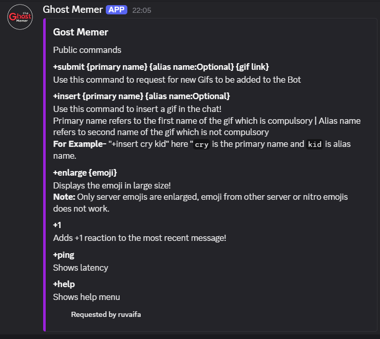
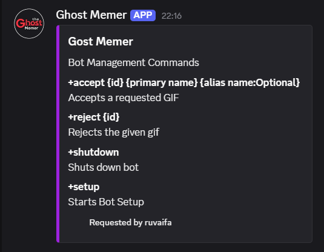

# 👻 Ghost Memer

Ghost Memer is a Discord bot built in **2020** designed to enhance chat interaction with GIFs, memes, emoji utilities, and reaction features. Users could submit their favorite GIFs, which would be reviewed and approved by moderators, and later used in the server through simple commands.

> 🛑 **This project is archived** — it is no longer maintained, and several features may not function due to outdated Discordand Reddit APIs.

---

## 📦 Archive Notice

This bot is uploaded for **archival purposes** and historical reference only.  
Some commands may break or behave unexpectedly due to:

- API changes (Reddit, Discord)
- Deprecated methods in `discord.py`
- Library or token permission mismatches

---

## 🔐 Setup

1. Clone the repository.
2. Install dependencies:
   ```bash
   pip install discord.py python-dotenv praw requests
   ```
3. Create a `tokens.env` file in the root directory:
   ```
   API_KEY="your_discord_bot_token"
   CLIENT_ID="your_reddit_client_id"
   CLIENT_SECRET="your_reddit_client_secret"
   ```

4. Run the bot:
    - Simply run the `start.bat` file.

---

## 💡 Features

### 🔓 Public Commands
| Command | Description |
|--------|-------------|
| `+submit {primary name} {alias name:Optional} {gif link}` | Request a new GIF to be added |
| `+insert {primary name} {alias name:Optional}` | Send a GIF using the given name/alias |
| `+enlarge {emoji}` | Enlarges and sends the server emoji |
| `+1` | Adds a ✅ "+1" reaction to the most recent message |
| `+ping` | Displays the bot's latency |
| `+help` | Displays the help menu |

> 🧠 *Primary name* is required; *alias name* is optional.  
> Example: `+insert cry kid` → `cry` is the primary name, `kid` is alias.

---

### 🔒 Bot Management Commands
| Command | Description |
|--------|-------------|
| `+accept {id} {primary name} {alias name:Optional}` | Approves a submitted GIF |
| `+reject {id}` | Rejects the submitted GIF |
| `+setup` | Initiates interactive bot setup (channel and role config) |
| `+shutdown` | Shuts down the bot (owner-only) |

---

## 🖼 Help Menu Preview

> Below are the actual help embeds shown in Discord:

### Public Commands  


### Management Commands  


---

## 🧱 Tech Stack

- `discord.py` (legacy async version)
- `PRAW` – Reddit API wrapper
- `Tenor API` – GIF handling
- `sqlite3` – Database for storing GIFs
- `dotenv` – API key management

---

## 👨‍💻 Author

Built by Ruvaifa in 2020  
Uploaded in 2025 for archive purposes
